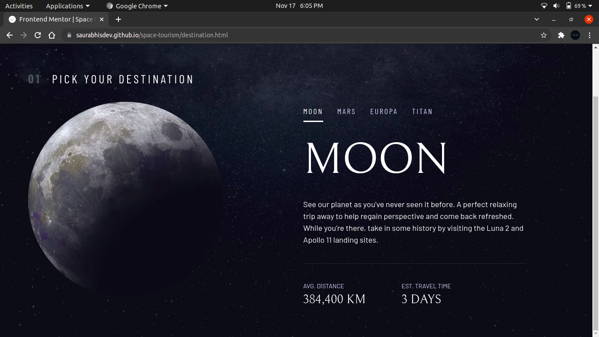
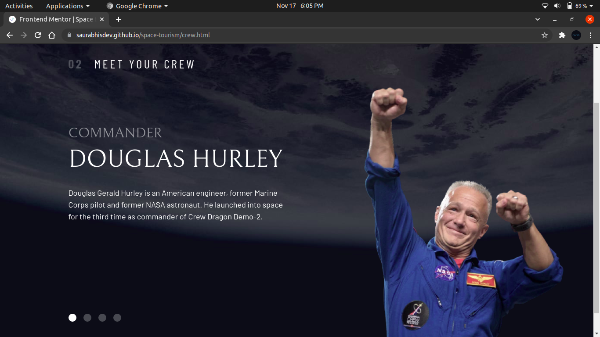
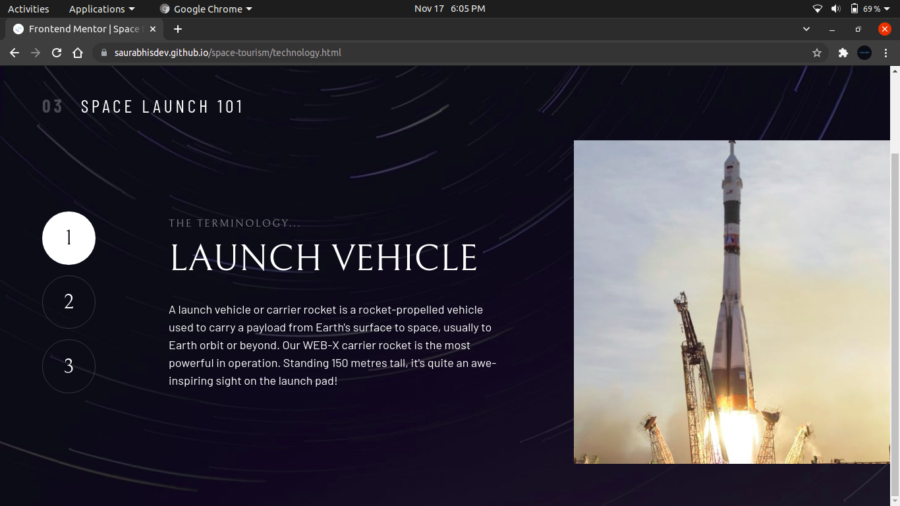

# Frontend Mentor - Space tourism website solution

This is a solution to the [Space tourism website challenge on Frontend Mentor](https://www.frontendmentor.io/challenges/space-tourism-multipage-website-gRWj1URZ3). Frontend Mentor challenges help you improve your coding skills by building realistic projects. 

## Table of contents

- [Overview](#overview)
  - [The challenge](#the-challenge)
  - [Screenshot](#screenshot)
  - [Links](#links)
- [My process](#my-process)
  - [Built with](#built-with)
  - [What I learned](#what-i-learned)
  - [Continued development](#continued-development)
  - [Useful resources](#useful-resources)
- [Author](#author)
- [Acknowledgments](#acknowledgments)

## Overview

### The challenge

Users should be able to:

- View the optimal layout for each of the website's pages depending on their device's screen size
- See hover states for all interactive elements on the page
- View each page and be able to toggle between the tabs to see new information

### Screenshot






### Links

- Solution URL: [Website solution URL here](https://github.com/saurabhisdev/space-tourism.git)
- Live Site URL: [live site URL here](https://saurabhisdev.github.io/space-tourism/)

## My process

### Built with

- Semantic HTML5 markup
- CSS custom properties
- Flexbox
- CSS Grid
- CSS Utility Classes
- Mobile-first workflow
- Javascript

### What I learned

In this section I’ll summarise what I’ve learnt from this Challenge.

Resets:
To avoid the unwanted inconsistencies due to default styles applied by the browser we must reset the styles that we may use.

We applied the following resets initially:-

- On All Selectors
```css
*,
*::before,
*::after {
    box-sizing: border-box;
}
```
- On Body
```css
body {
    font-family: var(--ff-sans-normal);
    font-size: var(--fs-400);
    color: hsl( var(--clr-white) );
    background-color: hsl( var(--clr-dark) );
    line-height: 1.5;
    min-height: 100vh;
    
    display: grid;
    grid-template-rows: min-content 1fr;
    
    overflow-x: hidden;
}
```
- Image and picture
```css
img,
picutre {
    max-width: 100%;
    display: block;
}
```
- On Form elements
```css
input,
button,
textarea,
select {
    font: inherit;
}
```


Custom Properties:
Custom Properties helped me to maintain my code in long run. It allow us update a property at one place and changes reflects in entire document.

Used for:-
- font-size
- font-color 
- font-family

Utility Classes:
We have adopted a utility-first approach to CSS. Utility classes made out development a lot faster and easier. No doubt I am in love with them.

Most used Utility classes:-
- Flex and grid
- Font color, size and family
- Bg-Color, Text-Color, letter-spacing
- Container[To apply space left and right]
- Screen Reader only[To hide text from screen reader]
- Flow[To add spacing]
- numbered-title ...

e.g. A utility class to add spacing between the content evenly.
```css
.flow > * + * {
    margin-top: var(--flow-space, 1rem);
}
```

Components:
Below are the components that allowed us to write DRY code:-
- logo
- primary-navigation
- mobile-nav-toggle
- large-button
- underline-indicators
- dot-indicators
- number-indicators ...

e.g. Component for Explore Button
```css
.large-button {
    font-size: 2rem;
    position: relative;
    z-index: 1;
    display: inline-grid;
    place-items: center;
    padding: 0 2em;
    border-radius: 50%;
    aspect-ratio: 1;
    text-decoration: none;
}
```
New CSS Functions:
- Clamp
- aspect ratio
- minmax
- vmin & vmax
- order
- backdrop-filter

Responsiveness:
- ch(character width)
- media queries (35rem,45rem)
Layout:

HTML Attributes:
- data-*** (custom Attribute)
- aria-controls
- aria-expanded
- aria-hidden
- aria-selected
- aria-label
- srcset
- tabindex
- role

Semantic flow
```html
<!DOCTYPE html>
<html lang="en">

<head>
    <title>Document</title>
</head>

<body>
    <header>
        
        <nav></nav>
    </header>

    <main>
        <h1></h1>
        <div class="dot-indicators"></div>
        <article class="destination-info">
            <header>
                <h2></h2>
                <p></p>
            </header>
        </article>
        <picture></picture>
    </main>
</body>

</html>
```


Elements required for Functionality:
- nav and navToggle
- tablist and tabs
- targetTab, targetPanel and targetImage
- tabContainer and mainContainer
```js
const targetTab = e.target;
    const targetPanel = targetTab.getAttribute("aria-controls");
    const targetImage = targetTab.getAttribute("data-image");
    
    const tabContainer = targetTab.parentNode;
    const mainContainer = tabContainer.parentNode;
```

Functions:
- changeTabFocus
- hideContent
- showContent
```js
function hideContent(parent, content) {
    parent
        .querySelectorAll(content)
        .forEach((item) => item.setAttribute("hidden", true));
}

function showContent(parent, content) {
     parent.querySelector(content).removeAttribute('hidden');
}
```

### Continued development

In future projects-
- I will be focusing more on using Javascript and React.
- Commanding more on CSS flex and CSS grids.
- Learn to use mordern CSS properties
and much more...

### Useful resources

- [Mordern CSS reset](https://piccalil.li/blog/a-modern-css-reset/) - This id an amazing article that helped me to understand the CSS resets and their use. Also to use them in a mordern way.
- [MDN Web Docs](https://developer.mozilla.org/en-US/) - I think everyone has heard about it. Helped me understand basics of the new concepts.

## Author

- Website - [Saurabh Singh](https://saurabhisdev.github.io/space-tourism/)
- Frontend Mentor - [@saurabhisdev](https://www.frontendmentor.io/profile/saurabhisdev)
- Twitter - [@sauravsinghbsr](https://twitter.com/sauravsinghbsr)

## Acknowledgments

I would like to thank my teacher [Kevin Powell](https://twitter.com/KevinJPowell) who guided me on this wonderful project on topic "Space Tourism Website". Secondly I would like to thanks [Frontend Mentor](https://www.frontendmentor.io/) and [Scrimba](https://scrimba.com/) who provided all the resources required for building the website.

This project helped me in doing a lot of research on various concepts which ultimately increased my understanding of HTML and CSS. I came to knew about so many new things.

